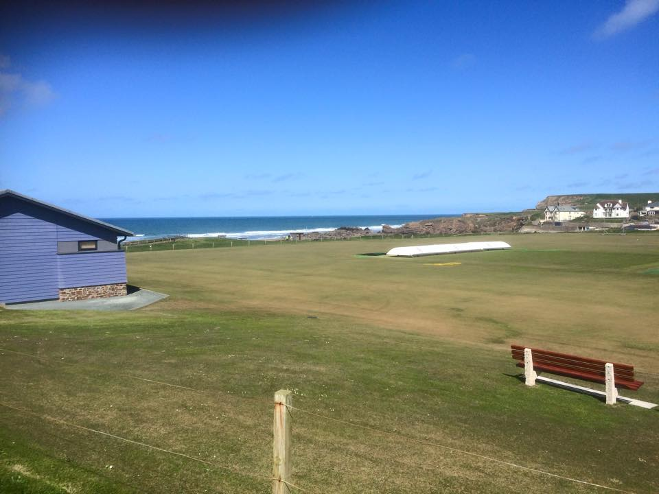
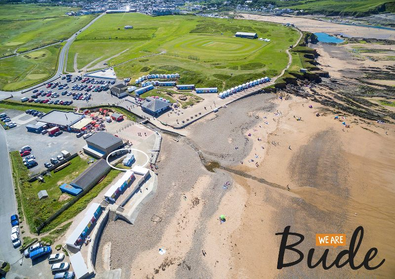
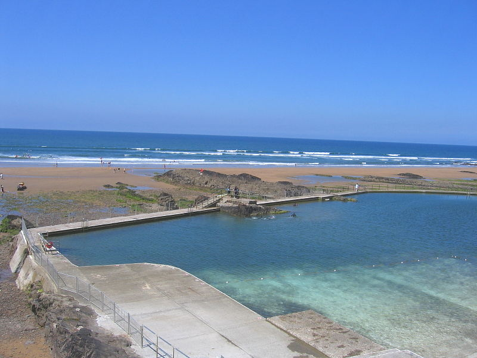
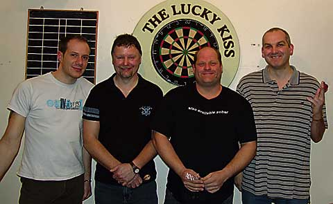
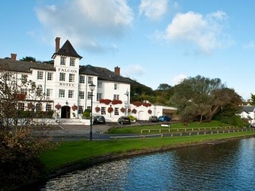
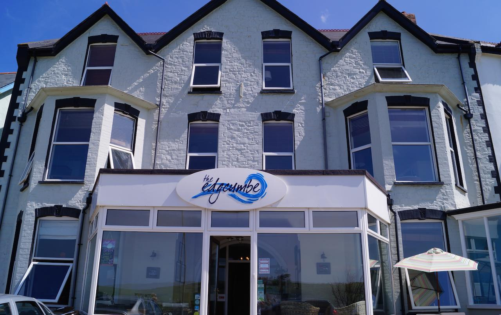

```{r setup, include=FALSE}
knitr::opts_chunk$set(echo = TRUE)
```

```{r echo=FALSE}
library(leaflet)
library(ggplot2)
library(ggmap)
library(tidyverse)
library(sp)
library(rgdal)  
library(maps)

#get the geocode for required positions
bude <- geocode("Bude, England, UK")
bude <- fortify(bude)

bar <- geocode("The Lucky Kiss, 20 Belle Vue, Bude EX23 8JL, UK")
data_bar <- fortify(bar)

cricket <- geocode("Bude North Cornwall Cricket Club, S W Coast Path, Bude EX23 8HN, UK")
data_cricket <- fortify(cricket)

Crooklets_Beach <- geocode("S W Coast Path, Bude EX23 8NE, UK")
data_Crooklets_Beach <- fortify(Crooklets_Beach)

Summerleaze_Beach <- geocode("Summerleaze Cres, Bude EX23 8HN, UK")
data_Summerleaze_Beach <- fortify(Summerleaze_Beach)

data_all <- rbind(data_bar,data_cricket,data_Crooklets_Beach,data_Summerleaze_Beach)

#get the road info
start <- "20 Belle Vue, Bude EX23 8JL, UK"
end <- "Bude North Cornwall Cricket Club"
route <- route(start, end, structure = "route")

route_data <- data.frame(x = route$lon, y= route$lat)

#prepare for the popup
c_beach_p <- paste(sep = "<br/>",
                 "<b><a href='https://www.visitcornwall.com/beaches/lifeguards-seasonal/north-coast/bude/crooklets-beach'>Crooklets Beach</a></b>",
                 "Adress: S W Coast Path, Bude EX23 8NE.",
                 "UK606 5th Ave"
)

bar_p <- paste(sep = "<br/>",
               "<b><a href='https://thegoodpubguide.co.uk/pub/ex23+8jl/the+lucky+kiss+sports+bar/'>Lucky Kiss Sports Bar</a></b>",
                 "Phone: +44 1288 356788",
                 "Opening hours",
                 "Monday 18:00 - 23:45",
                 "Tuesday 18:00 - 23:45",
                 "Wednesday 18:00 - 23:45",
                 "Thursday 18:00 - 23:45",
                 "Friday 18:00 - 03:00",
                 "Saturday 12:00 - 03:00",
                 "Sunday 12:00 - 02:30",
                 "Adress: 20 Belle Vue",
                 "Bude EX23 8JL, UK"
)

c_p <- paste(sep = "<br/>",
                 "<b><a href='http://budecc.play-cricket.com/'>Bude North Cornwall Cricket Club</a></b>",
                 "Adress: Bude North Cornwall Cricket Club",
                 "S W Coast Path, Bude EX23 8HN, UK"
)

s_beach_p <- paste(sep = "<br/>",
                 "<b><a href='https://www.visitbude.info/accommodation/extra-large-beach-huts/'>Summerleaze_Beach</a></b>",
                 "Adress: Summerleaze Cres",
                 "Bude EX23 8HN, UK"
)

road <- paste(sep = "<br/>",
              "The road that links cricket and bar"
)

falcon <- paste(sep = "<br/>",
                "The Falcon Hotel: 
                Breakwater Road, Bude, Cornwall, EnglandEX23 8SD")
edgcumbe <- paste(sep = "<br/>",
                "The Edgcumbe Hotel:
                 19 Summerleaze Cres, Bude EX23 8HJ, UK")
```

# 1. Introduction
Find the town of Bude in Western England. This is a town that is well-known as a beach resort. You're going to make two maps of Bude ?C a road map and a watercolor map.

On both maps, mark the map with vacation spots you might like: surfing beaches and the cricket grounds (one of the most stunning the the country and very local). Pick two local beaches (this will require some googling).

Finally find a pub that is convenient to the cricket grounds. Mark the route from the grounds to the pub.


# 2. Recommanded Places
## 1. Cricket ground: Bude North Cornwall Cricket Club
  Bude North Cornwall Cricket Club is situated on the clifftops overlooking the Atlantic Ocean, and is quite simply one of the most stunning locations you could ever wish to visit, let alone play cricket at! 
  Bude North Cornwall Cricket Club was founded in 1870. Over the years it has played host to Hockey matches, Tennis, Cricket and even used for Mortar practice in WW2!

{width=60%}


## 2. Crooklets_Beach
  A wide expanse of golden sand is exposed at low tide, bordered by rocky outcrops ideal for rock-pooling. Crooklets is at the north side of Bude and can be reached by a short walk over the Summerleaze Down or down the hill from the town centre.
  Crooklets is very popular with surfers and is home to the Bude Surf Life Saving Club.  The beach has great facilities including a large car park, level access and viewing area, a play area, skate park, beach cafe, showers, amusements and pubs close by.  
  There are various beach huts available for daily hire, from just ??10 - ??20 per day.  Please call the Tourist Information Centre on 01288 354240 to book.
  Please note: Dogs are welcome on this beach except between Easter Sunday and 30 September when a seasonal dog ban is in place.

{width=60%}


## 3. Summerleaze Beach
  Summerleaze has a unique appeal, not least because it is less than five minutes?? walk from the centre of Bude and the large car park leads directly to the sand dunes. The river, with its bobbing fishing boats, flanks the wide, sandy beach that is sheltered by the impressive breakwater, making the beach particularly popular with families and surfers. Beach Huts are bookable daily or weekly from ??10 - ??20 per day. Contact the Bude Tourist Information Centre on 01288 354240

{width=60%}


## 4. Nearby Pub : The Lucky Kiss
  The Lucky Kiss Sports Bar, 20 Belle Vue, Bude, Cornwall, EX23 8JL

{width=60%}


# 3. The mapping

## 1. The road map
```{r, echo=T}
m <- leaflet(route_data)

m %>%
  addProviderTiles(providers$OpenMapSurfer) %>%
  addPolylines(lng = ~ x, lat = ~ y, popup = road) %>% 
  addMarkers(lng = -4.544881,lat = 50.83062, popup = bar_p) %>% 
  addMarkers(lng = -4.552814,lat = 50.83347, popup = c_p) %>% 
  addMarkers(lng = -4.554378,lat = 50.83683, popup = c_beach_p) %>% 
  addMarkers(lng = -4.549855,lat = 50.83097, popup = s_beach_p) %>%
  addMarkers(lng=-4.5479, lat=50.8270, popup = falcon) %>%
  addMarkers(lng=-4.5487, lat=50.8314, popup = edgcumbe)
```

## 2. The water color map
```{r}
m %>%
  addProviderTiles(providers$Stamen.Watercolor) %>%
  addPolylines(lng = ~ x, lat = ~ y, popup = road) %>% 
  addMarkers(lng = -4.544881,lat = 50.83062, popup = bar_p) %>% 
  addMarkers(lng = -4.552814,lat = 50.83347, popup = c_p) %>% 
  addMarkers(lng = -4.554378,lat = 50.83683, popup = c_beach_p) %>% 
  addMarkers(lng = -4.549855,lat = 50.83097, popup = s_beach_p)  %>%
  addMarkers(lng = -4.5479, lat = 50.8270, popup = falcon) %>%
  addMarkers(lng = -4.5487, lat = 50.8314, popup = edgcumbe)
``` 

# Hotels in the Area
## The Falcon Hotel
{width=60%}

Established in 1798, the Falcon Hotel is the oldest coaching hotel in North Cornwall. For seven generations the Brendon Family, and their loyal staff, have provided ‘The Warmest Welcome in the West’ Overlooking the Bude Canal and only a short walk to stunning sandy beaches, we offer one of the finest settings of any hotel on the North Cornwall Coast. And with AA ***, superb conference facilities and a notable restaurant it’s the ideal place for business events & romantic weddings.

Source: http://www.falconhotel.com/
## The Edgcumbe Hotel
{width=60%}

Much more than just a place to stay. A beach style B&B, with the look and feel of a small hotel with the heart and soul of a family run business. Dont just stay....Belong.

Source: http://www.edgcumbe-hotel.co.uk/